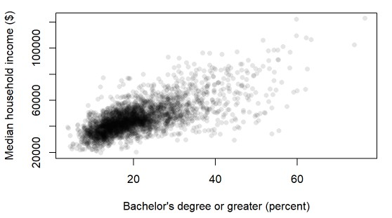
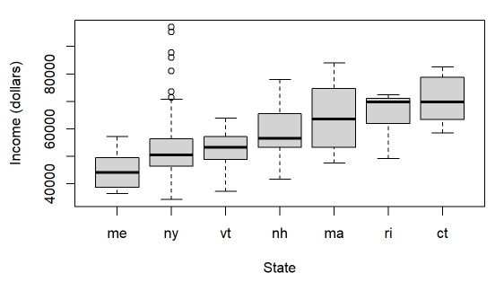

# HW 12

In this assignment, you will write a single R script that will generate two plots using the **base** plotting environment. You will restrict functions to those covered in class thus far. Each plot will be preceded with a comment indicating which plot number it is associated with. All data prepping must be performed in a piping operation using `dplyr`.

## Plot 1

Loading the US Census `ACS.csv` data file directly from <http://mgimond.github.io/ES218/Data/ACS.csv>, you will recreate the following scatter plot (including the axes labels) of median household income vs. percent of county population having attained a bachelor's degree or greater. Refer to the [online codebook](https://mgimond.github.io/ES218/Data/ACS_CodeBook.csv) for variable descriptions (the codebook does not need to be part of the R script). The values in the ACS table represent population counts. Each column breaks down the counts into population sub groups. Here, you will focus on the *entire* population having attained a bachelor's degree (i.e. the column associated with `Population 25 To 64 Years: Bachelor's Degree Or Higher`). The column associated with `Population 25 To 64 Years` represents the entire population count for each county. Columns associated with the labels `Std. Error: ...` can be ignored (these columns provide uncertainty in the estimated counts).

Note that each point in the plot represents a county. The points are symbolized using a transparency of 90% (or 10% opaqueness). Also note that the number of tic marks may change based on the graphic window size--you will not concern yourself with this detail.

## Plot 2

Continuing with the ACS data, you will create boxplots of median household income by state. You will limit the states to `me`, `nh`, `vt`, `ma`, `ri`, `ct` and `ny`. You will recreate the following plot where the boxplots are ordered by median state income.

