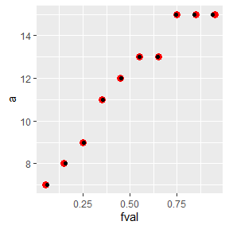
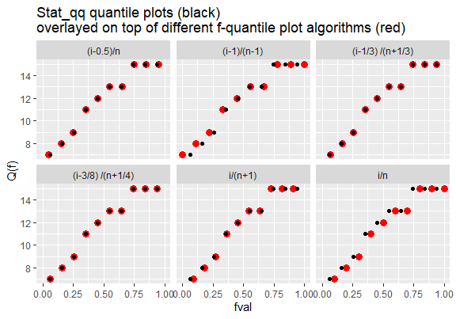

> You will submit this assignment as an R markdown (`HW16.rmd`) file.
> You will set the `code_folding` option to `hide`. Do not use the
> `echo = FALSE` options for you code chunks.

> For maximum credit, any data manipulation must be performed in a
> piping operation.

### Part 1

Thus far, you have learned how to combine different `geom` functions in
a single `gglot()` operation. For example, you can combine a boxplot
function with a jitter function as follows:

    ggplot(mtcars, aes(x = "", y = hp)) + geom_boxplot() + geom_jitter(width=0.2)

In the above example, all `geom` functions work off of the same dataset
and aesthetics defined in the `ggplot` function. But what if you want to
generate different plots using different aesthetics and/or datasets?
Answer: You do so by defining the aesthetics and/or datasets in their
respective functions. For example, the above code chunk could have been
rewritten as:

    ggplot(mtcars) +
      geom_boxplot(aes(x = "", y = hp)) + 
      geom_jitter(aes(x = "", y = hp), width=0.2)

or,

    ggplot() +
      geom_boxplot(data = mtcars, aes(x = "", y = hp )) + 
      geom_jitter (data = mtcars, aes(x = "", y = hp ), width=0.2)

Using the above tip, you will overlap the f-quantile plot [generated in
class on
Monday](https://mgimond.github.io/ES218/univariate_plots.html#computing-the-f-quantile)
with that generated by the [`stat_qq`
function](https://mgimond.github.io/ES218/univariate_plots.html#using-ggplots-qq-geom).
The former will be assigned large red color dots while the latter will
be assigned smaller black dots. You will use the same dataset used in
the lecture notes:

    set.seed(23)
    df <- data.frame(a = round(runif(10, 5, 15)))

The plot should look like the following:

### Part 2

Once you generate the above plot, you will notice that the points do not
overlap exactly. In fact, there is a slight discrepancy between the
computed f-values. This is not unusual given that there are at least
nine different ways in which one can compute the f-values. You can see a
list of methods in the `quantlile()` function help page (you can access
the page by typing `?quantile`). Note that the formulas displayed on the
help page use the variable *k* to represent the ith element
instead of the variable *i* as used in this course. For example, the
manual method computed in class, (*i*−0.5)/*n* , is **Type 5** on that
list; it’s reported as *p**k* = (*k*−0.5)/*n* on the help
page. Note that Types 1 through 3 do not apply to our data since these
are for discontinuous datasets.

Unfortunately, the `stat_qq` documentation does not state which
algorithm it adopts to compute its f-values. You will therefore modify
your manually computed f-values by trying out each algorithm listed on
the `quantile` help page (types 4 through 9) until you find the one that
generates the same set of f-values (i.e. when the points overlap).

In addition to generating the plot, you will write a sentence or two
describing the quantile algorithm adopted by `stat_qq`. You will use the
[inline equation
syntax](https://mgimond.github.io/ES218/rmarkdown.html#text-formats)
when defining the algorithm in your write-up.

### Part 3: Challenge (optional – not graded)

In a single piping operation, can you you generate a table in long form
that can be then used in `ggplot` to generate the following faceted
table?

#### Hints:

-   Because `a` is generated randomly each time the `runif` function is
    called, we need to create it separately, then replicate in a
    data.frame(). Since we will evaluate six quantile types, we will
    need six replicates.

<!-- -->

    set.seed(23)
    a <-round(runif(10, 5, 15))
    df <-  data.frame(a = rep(a, length.out = 6),
                      type = rep(1:6, each=length(a)))

-   You can store formulae as variables. To convert a formula variable
    to an actual formula, use the `eval()` and `parse()` functions, for
    example:

<!-- -->

    df$form <- "(i - 0.5)/n"

    df %>% mutate(n = n(),
                  i = 1:n(),
                  fval = eval(parse(text = form)),
                  qtype = 5)
