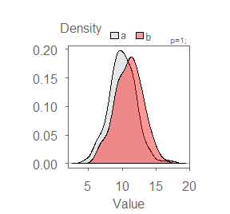
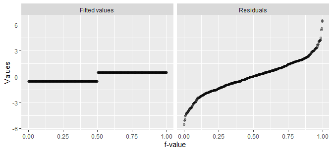
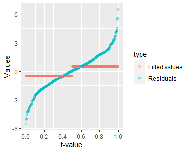

In this assignment, you will generate three residual-fit spread plots,
each with different levels of mean spreads relative to the residual
spread. You will do so by creating simulated datasets using the `rnorm`
function. Its first argument is the number of simulated values (we’ll
use `200` in this assignment). The second number is the mean value, and
the third value is the standard deviation about the mean. The +/-1
standard deviations encompasses about 68% of the distribution of values
about the mean.

For example, the following code chunk will generate two simulated
batches centered on a mean of `10` and `11` respectively, each with a
standard deviation of 2.

    n <- 200  # Number of simulated values in each batch
    a <- rnorm(n, 10, 2)
    b <- rnorm(n, 11, 2)
    df <- data.frame( x = c(a, b),
                      group = c(rep("a", n), rep("b", n)))

This generates the following density distributions.

Note that because the sample sizes are relatively small, you will not
necessarily see a textbook normal distribution from the data even though
they are generated from a normal distribution.

The above dataset will generate the following r-f spread plot:

Note that it may be easier to compare the batches by overlapping their
f-quantile plots.

The r-f plot suggests that the fitted mean values cover a span of about
1 unit (this is to be expected since the simulated values have means
that differ by one unit). This span of 1 unit is small compared to the
span covered by the residuals which span about 10 units (about -5 to + 5
along the y-axis–we ignore the extreme ends of the distribution). So the
difference in means explains about 1/5 \* 100 = 20% of the variability
in the data.

You will simulate two other sets of values to create two additional r-f
spread plots: one where the spread in mean values is about half that of
the residuals’, the other where the spread in mean values is about the
width of that of the residuals. This will require some trial and error
when simulating the values.

You will submit this assignment in an Rmd document. You will also
describe how much of the total variability in the data can be explained
by the spread in fitted mean values for each plot.
